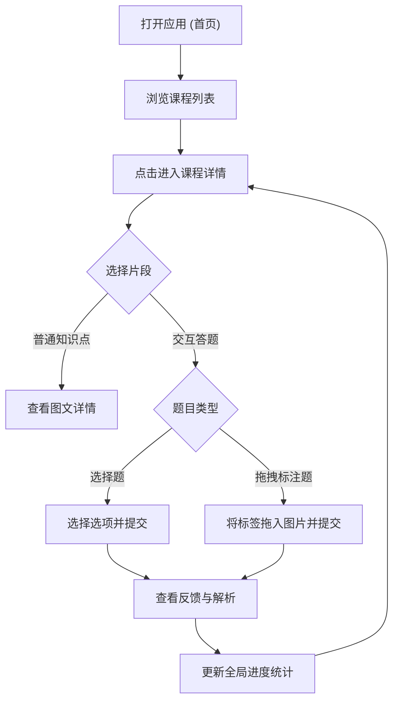

## 1. 产品概述
本项目是一个面向移动端的“医学 AR+VR 教程”交互式学习与答题系统。
主要目标：通过直观的图像交互和答题测试，帮助医护人员或患者规范学习常见的医疗操作（如注射胰岛素、血糖仪测血糖、咳痰训练）。
核心价值：替代传统 Kivy 应用，提供更现代、响应迅速且美观的移动端 Web UI，支持完整的中文显示，并最终打包为 Android APK 以供安卓设备使用。

## 2. 核心功能

### 2.1 用户角色
| 角色 | 注册方式 | 核心权限 |
|------|----------|----------|
| 学习者 | 无需注册 | 浏览教程、查看视频节点图片、参与交互式答题（选择题/标注题） |

### 2.2 功能模块
1. **首页 (Home)**：展示应用标题、学习进度统计以及所有可用课程的列表。
2. **课程详情页 (Course Detail)**：展示课程概览、缩略图和各个知识片段的时间节点与简介。
3. **交互弹窗 (Interaction Popup)**：支持知识片段的详情展示、单项选择题测试以及图片热区拖拽标注题。

### 2.3 页面详情
| 页面名称 | 模块名称 | 功能描述 |
|----------|----------|----------|
| 首页 | 顶部概览 | 展示应用名称、副标题、当前完成/答对的题目进度统计 |
| 首页 | 课程列表 | 以卡片形式展示每个课程（标题、简介、片段数量、进入按钮） |
| 课程详情 | 英雄区 | 顶部大图和课程详细描述 |
| 课程详情 | 片段列表 | 垂直滚动的时间线或列表，列出每个时间节点的片段，点击后可触发知识点或答题 |
| 交互弹窗 | 知识点弹窗 | 展示时间节点图片和详细文字说明 |
| 交互弹窗 | 选择题弹窗 | 展示问题、图片及选项按钮，提交后给出正误反馈 |
| 交互弹窗 | 标注题弹窗 | 用户可将文字标签（Chip）拖拽至图片上的正确位置，完成后验证答案 |

## 3. 核心流程
用户学习主流程：进入首页 -> 查看进度与课程列表 -> 选择一门课程 -> 浏览知识片段 -> 若片段包含问题，则弹出答题卡 -> 用户作答 -> 获得即时反馈（正确/错误）并更新全局进度。

## 4. 用户界面设计
### 4.1 设计风格
- **主色调**：医疗科技风，深蓝/深灰背景（如 `#0F172A`），辅以明亮的强调色（如青色 `#06B6D4` 或蓝色 `#3B82F6`）。
- **辅助色**：成功（绿色 `#10B981`），警告/错误（红色 `#EF4444`），文字色使用高对比度白色/浅灰。
- **按钮样式**：圆角 (Rounded-xl)、带有微发光或玻璃拟态 (Glassmorphism) 效果。
- **字体与排版**：使用现代无衬线中文字体（如系统默认的 PingFang SC / Microsoft YaHei，或引入优雅的 Web 字体），层级分明。
- **布局风格**：卡片式设计，底部/顶部固定导航，符合移动端直觉的触摸热区尺寸。

### 4.2 页面设计概览
| 页面名称 | 模块名称 | UI 元素 |
|----------|----------|---------|
| 首页 | 概览卡片 | 渐变背景色块，大号粗体标题，高对比度进度数据 |
| 首页 | 课程卡片 | 左侧/顶部缩略图，右侧/底部文字，柔和阴影，点击涟漪动画 |
| 课程详情 | 片段卡片 | 时间轴样式的左侧边框，带颜色标识的 Badge (知识点/交互题) |
| 交互弹窗 | 答题区 | 居中弹出的模态框，背景模糊，大尺寸的选项按钮，拖拽时有悬浮阴影效果 |

### 4.3 响应式要求
- **Mobile-first** 移动端优先：由于最终目标是 Android APK，UI 必须完美适配手机竖屏比例。
- **触摸优化**：按钮高度不小于 44px，提供清晰的按下反馈（Active state）。
- **拖拽支持**：标注题需支持移动端 Touch 事件的平滑拖拽。
