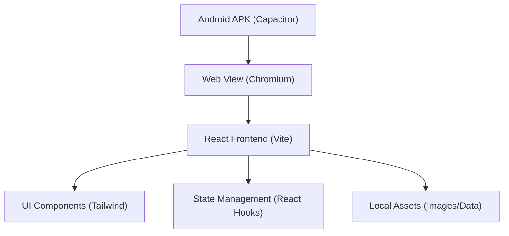

## 1. 架构设计
本项目将重构原有的 Python/Kivy 应用，采用纯前端 Web 技术栈进行开发，然后通过 Capacitor 将其封装为 Android APK。所有数据将硬编码在前端状态化存储中，图片资源将沿用项目自带的 `assets/source` 目录。



## 2. 技术栈说明
- **前端框架**：React@18 + TypeScript + Vite
- **样式方案**：Tailwind CSS @3 (用于快速、美观的移动端 UI)
- **图标库**：Lucide React
- **拖拽库**：dnd-kit (用于实现标注题的拖拽功能，支持移动端 Touch 传感器)
- **移动端封装**：Capacitor (@capacitor/core, @capacitor/android, @capacitor/cli)
- **资源处理**：图片资源直接存放在 `public/assets` 或由 Vite 构建打包。

## 3. 路由与视图定义
由于这是一个轻量级移动应用，无需复杂的 Router 库，使用简单的条件渲染或轻量级路由即可：
| 视图 | 用途 |
|------|------|
| `HomeView` | 展示全局进度与课程列表 |
| `CourseView` | 展示选定课程的详细信息与片段列表 |
| `PopupModal` | 覆盖在当前视图上的弹窗，用于知识点查看或交互答题 |

## 4. 核心数据模型 (Data Model)
前端直接维护的 JSON 结构化数据，对应原有的 `VideoDataManager`：

```typescript
type Course = {
  id: string;
  title: string;
  description: string;
  thumbnail: string;
  video_segments: Segment[];
};

type Segment = {
  id: string;
  time: number;
  time_display: string;
  description?: string;
  image?: string;
  has_question?: boolean;
  question_type?: 'multiple_choice' | 'annotation';
  question?: string;
  options?: string[];
  correct_answer?: number;
  feedback?: string;
  answer_image?: string;
  annotations?: { name: string }[];
};

type AppState = {
  answered: number;
  correct: number;
  total: number;
};
```

## 5. 打包与构建流程
1. **开发阶段**：`npm run dev` 在浏览器中进行开发和 UI 调试。
2. **构建 Web 产物**：`npm run build` 生成 `dist` 目录。
3. **同步 Android 平台**：`npx cap sync android`。
4. **生成 APK**：通过 Github Actions 中的 Gradle 任务 (或本地 `./gradlew assembleDebug`) 生成 APK 产物。
